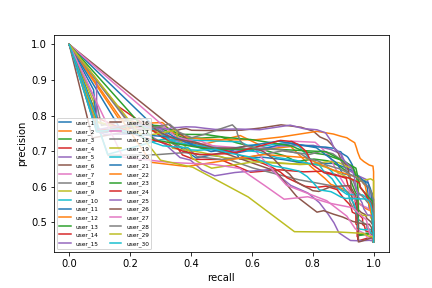
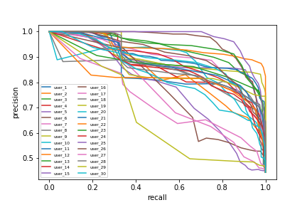

## Final Report

#### Group Organization

The various tasks varied in their ability to be split into subtasks. For the MLP- and SVM-classifiers, we decided to split into two groups,
in which each group member developed their own solution. During this, we cross-validated our results and exchanged methods. For the two 
following exercises, where such division of labor was not possible, we increased the amount of zoom-meetings to 2-3 meetings per week to compensate for a less efficient workflow. The work was cut into smaller tasks in which one or more team-members were responsible for. These tasks were usually done in 1-3 days, and the progress was discussed in the next meeting. If there were any issues during code-development, we communicated by text and helped each other out.

We didn't utilise the possibility to work on the same files using different branches as we do not feel as comfortable working
this way. Because of this, we created files with variations of the code and incorporated them into the main file. We also always screened
each others code before fitting it into the main file.

#### General evaluation of group organization

The large amount of meetings helped to verify where everyone was in their individual progress. Reviewing each other's code so often helped having a clear view for every team member on the way the code was constructed. We also realised that the organization improved for tasks 3 and 4. This is probably due to the decreased possibility to split the work and the need for more communication within the group. for task 2, we lost some time by coding each task twice, however, this helped each team-member to learn and gain experience on their own. Coding on our own, however, caused us hitting dead ends more often.

#### Task 2a

As mentioned before, the tasks a and b were done twice by two members each. We used the sklearn-library for both solutions. We applied the learning algorithm with a linear and an RBF-kernel, and tuned for the parameter C. Parameter tuning was accomplished using a grid search, for which we also utilised a function from sklearn.

For this task and also task 2b and 2c, we hadn't encountered much room for creativity, as the task was mostly centered around utilising each library and getting them to work properly. As we were also using a well-known dataset (MNIST), using solutions found online was the most efficient way to go. Most of these solutions give a great overview on the different libraries, however, certain details were not always explained sufficiently. Although it is good to get a grip on the different existing frameworks, we struggeled with modifying the code to match our wishes because of this circumstance. 

#### Task 2b
We used the tensorflow library and the sklearn library for our two solutions. The solution using sklearn was handed in.
We optimized for the parameters hidden layer size, the amount of hidden layers, the learning rate, and the maximal amount of iterations. We used randomized search. In hindsight, for the small amount of parameters that were tested out, a grid search would have probably been more suited. 

Some parameters are already handled by the libraries. For example, there are ways to adjust the learning rate during learning, which reduces the significance of the initial learning rate. Also, in sklearn, the learning stops when the loss does not improve significantly anymore. This complicated the identification of the optimal amount of iterations, as the optimization algorithm returned something else than what was indicated by the automatic learning termination. Also, plotting of the loss-curve was more difficult than expected, as there were few ways to access this loss.

#### Task 2c
This task was done using pytorch. We did parameter optimization on the learning rate and epoch size, where we chose between several possible values using a grid search. We use stochastic gradient descent as the optimizer and negative log likelihood loss as the loss function.

As there was code provided, we encountered the issue of understanding the code written by someone else. We actually had a different solution created before we could fully utilize the template. After this obstacle was overcome, the exercise was straight forward and the results came out as expected.
#### Task 3

A general challenge for this task was, that its complexity made it difficlut to divide it up in smaller parts. Hence, it was sometimes hard to follow the progress of other team members.

Initially we struggeled with the extraction of the different words. We soon realized that it would be disadvantagous to cut them out in the shape of the given mask, because this would make it harder to find a general approach for the coming processing steps. Additionally, we were not familiar with the svg format which made the cutting out even harder. Finally, one team member found a way to cut out the words as a rectangle, which made the programming of a sliding window easier.  

Furthermore, we had some issues with handling missing values. If there are no black pixels in a window, how would we signify the non-existent upper and lower contour? Using 'None' at first needed a lot of complicated build-arounds, and thus we decided to use 0 instead, as it should not have any mathematical implications.

Most results were not of the quality we hoped for. The maximal precision that was reached in most words was very low. We thus changed some details about the evaluation and implemented a package for the dynamic time-warping, which not only improved the precision, but also made the algorithm feasible in terms of time.

Our group organization in this task was improved strongly in comparison to 2a-d, which simplified the exploration of different ideas. Due to the good organization, we had time at the end to try out the mentioned improvements as well.

#### Task 4

We were able to re-use most of the code from task 3, with utilising our aforementioned improvements found at the end of the last task.
Plotting the P/R-curve for each feature separately helped finding out the significance of each feature. We found out, that the x and y values do not provide a good feature and the categorisation improves if we remove them for the evaluation. We also normalized within features and images, which we didn't do in task 3. 

Evaluation P/R curves for all users using all features

Evaluation P/R curves for all users using all features except the x- and y-position.

The results look much improved in comparison to task 3. This can be explained by already extracted features and less categories to choose from. Furthermore we would expect very high similarity for a signature of a person. As we looked at the output from the DTW algorithm, this was confirmed. In this exercise, we only have the possibility of choosing "forged" or "real", and the probability of choosing the right one by chance is approximately 55%. The gathered P/R-curves look exactly as expected, which is a confirmation that our algorithms from task 3 were working. Also, we see a stark difference between including the x- and y-position as features or not.

The good organization in task 3 simplified this task immensely, as everybody was very familiar with the problem and adjustments were found quickly.
