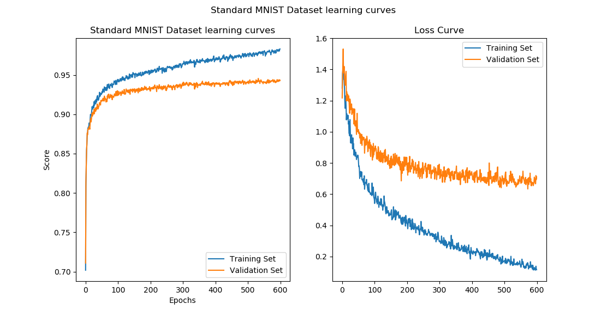

## Report for Exercise 2b

The multilayer perceptron was created using the function 'MLPclassifier' from the 'sklearn'-library.
For optimizing the parameters 'learning_rate_init', 'hidden_layer_sizes' and 'max_iter', the function 'RandomizedSearchCV' was utilised.

#### Optimized parameters:
* Learning rate: 0.001
* hidden layer size(s): (100, )
* maximal iterations: 400 

We found out that a single hidden layer with a large number of nodes will yield the best results. Adding another layer does not 
improve the learning. 
We used constant learning rates, as the exercise description suggests this, although there are methods to
optimize the learning rate during testing.
400 iterations of learning seem adequate, although the function will terminate learning by itself if the loss function does not improve
after 10 iterations.  Most runs stopped between 330 and 380 iterations.

#### Other Parameters:
* Activation function: 'logistic'
* solver: 'sgd' (stochastic gradient descent)
* Batch size: 50

The batch-size determines after how many samples the weights will be updated. With a smaller batch size, less iterations will be needed.

#### Results:

The loss-function used here is cross-entropy. There is no clear evidence of overfitting after 600 epochs, in contrary of what could be
expected. We would expect after some epochs to see a minimum in loss. This could be due to the batch size of 50, where we won't reach
that minimum as fast. Similar can be seen regarding the accuracy (on the left), as the plateau is not reached as fast as seen in the solutions for exercise 2c. A smaller batch-size could thus be desirable, to reach said plateau faster and to reach the loss minimum. Looking at the difference between training and validation, this is more or less what we can expect, as the model is not trained with the
validation data but still reaches a considerably high accuracy.

Results with the chosen best model: 

* Accuracy of cross-validation: 0.963
* Accuracy of testing: 0.897

Results in accuracy are lower than achieved with the CNN in exercise 2c. This was expected, as the dimensionality of the image is preserved during CNN-learning, whereas flattening of the image in MLP can lead to information-loss. Furthermore, using kernels to emphasize certain features also improves results.

All sources can be found in the .py-file.
